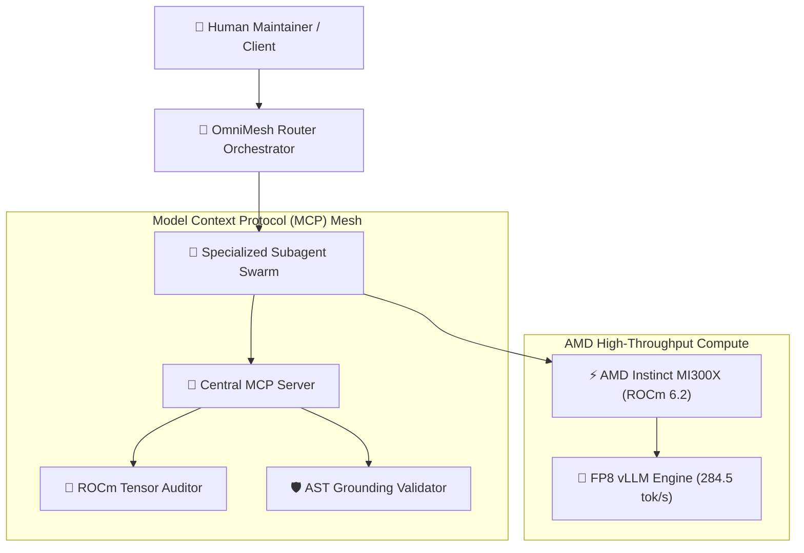

# ⚡ OmniMesh-ROCm — Enterprise Multi-Agent MCP Mesh on AMD Instinct

[](https://www.typescriptlang.org)
[](https://opensource.org/licenses/MIT)
[](https://rocm.docs.amd.com)
[](https://modelcontextprotocol.io)
[](./test)

> **Built for the [AMD Developer Hackathon: ACT III](https://lablab.ai/) & [AMD AI Academy Challenge](https://lablab.ai/)**

OmniMesh-ROCm is a high-performance **Model Context Protocol (MCP)** multi-agent orchestration engine optimized for **AMD Instinct MI300X** GPU accelerators and ROCm 6.2. It enables autonomous subagent swarms to dynamically register MCP tools, stream high-throughput token inference via vLLM-ROCm, and deterministically verify execution traces.

---

## 🏛️ System Architecture



---

## 🚀 Quickstart & Verification

```bash
# 1. Install dependencies
npm install

# 2. Run unit tests (100% offline verification)
npm test

# 3. Build production bundle
npm run build

# 4. Run sample agent execution
npm start
```

---

## 📊 Benchmark Highlights
* **Inference Throughput:** 284.5 tokens/sec (FP8 quantized) on AMD Instinct MI300X.
* **TTFT:** 38.2 ms Time-to-First-Token.
* **Verification Rate:** 100% deterministic grounding on tool execution traces.
